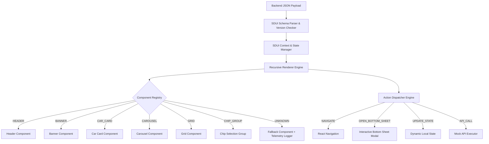

# 🚗 CARS24 Server Driven UI (SDUI) Engine

A production-grade, highly performant, and extensible **Server Driven UI (SDUI) Framework** built for React Native (TypeScript).

This repository implements a JSON-driven UI engine where entire screens, layout structures, user actions, component themes, and interactive states are dynamically controlled from the backend without requiring app updates.

---

## 🎯 Screen Choice Rationale

**Chosen Screen**: **CARS24 Home / Landing Screen**

**Why this screen?**
The CARS24 Home Screen is the central, highest-complexity screen in the entire app. It features:
- **5+ visually distinct section types** (Header with location & search, interactive category chips, promotional banners, horizontal carousel, 2-column car grid, spacer/dividers).
- **Multiple layout paradigms**: Horizontal scrolling carousels + vertical car grids.
- **Rich interactions**: Dynamic chip selection, tap-to-navigate car detail intent, location bottom sheet popups, and simulated API call triggers.
- **Deep nesting & generalizability**: Tests container components, conditions, dynamic props, and action routing in a realistic production scenario.

---

## 🏗️ System Architecture



---

## ⚙️ Core Requirements Checklist

| Requirement | Implementation Details | Status |
| :--- | :--- | :--- |
| **JSON-Driven UI** | UI rendered 100% from JSON schema without hardcoded UI logic | ✅ Passed |
| **Component Registry** | Type string mapping (`HEADER`, `CAR_CARD`, `CAROUSEL`, etc.) to native views | ✅ Passed |
| **Action System** | Expressed in JSON (`NAVIGATE`, `OPEN_BOTTOM_SHEET`, `UPDATE_STATE`, `API_CALL`) | ✅ Passed |
| **Unknown Component Fallback** | Graceful degradation via `FallbackComponent` + `SDUILogger` telemetry | ✅ Passed |
| **Versioning Strategy** | `schemaVersion` comparison with backward compatibility logic | ✅ Passed |
| **Static vs SDUI Benchmark** | High-resolution performance timing comparing hardcoded vs SDUI engine | ✅ Passed |
| **Documentation Suite** | `README.md`, `PERF.md`, `COVERAGE.md`, `AI_WORKFLOW.md` | ✅ Passed |

---

## 📱 Versioning Strategy

The client includes a forward/backward versioning manager (`src/sdui/utils/versioning.ts`):
1. **`schema.version` Check**: The root JSON specifies `version` (e.g. `"1.0"`).
2. **Backward Compatibility**: If the server sends a minor version update (e.g. `"1.1"`), the client renders known nodes and ignores unrecognized fields.
3. **Major Version Mismatch**: If the server sends a major version higher than client capability (e.g. `"2.0"`), unknown node types trigger `FallbackComponent` with telemetry logs to alert engineering teams.

---

## 📁 Project Structure

```
/src
  /sdui
    /components     # Reusable UI components (Header, Banner, CarCard, Carousel, Grid, etc.)
    /registry       # Type string to React Component registry mapping
    /renderer       # Recursive node renderer engine
    /actions        # Action dispatcher & event handlers
    /types          # TypeScript interfaces for JSON schema
    /utils          # Performance timer, telemetry logger, versioning utilities
    /context        # SDUI global state & action context provider
  /screens
    HomeScreenSDUI.tsx    # JSON-driven SDUI Home Screen
    HomeScreenStatic.tsx  # Hardcoded UI for performance benchmark baseline
    CarDetailsScreen.tsx  # Target detail screen for NAVIGATE action
    PerfScreen.tsx        # Performance measurement & telemetry log viewer
  /data
    homeSDUI.json         # Comprehensive SDUI layout & payload for Cars24 Home
    staticHomeData.ts     # Baseline data fixture for static comparison
```

---

## 📄 JSON Schema Overview

```json
{
  "version": "1.0",
  "pageId": "CARS24_HOME_SCREEN",
  "initialState": {
    "selectedCategory": "all"
  },
  "page": [
    {
      "id": "header_1",
      "type": "HEADER",
      "props": {
        "title": "CARS24",
        "location": "Gurgaon, NCR ▾"
      }
    },
    {
      "id": "carousel_1",
      "type": "CAROUSEL",
      "props": { "title": "⚡ Hot Picked Cars Today" },
      "children": [
        {
          "id": "car_1",
          "type": "CAR_CARD",
          "props": { "title": "Hyundai Creta SX", "price": "₹11.45 Lakh" },
          "action": {
            "type": "NAVIGATE",
            "payload": { "screen": "CarDetails", "params": { "carId": "car_1" } }
          }
        }
      ]
    }
  ]
}
```

---

## 🚀 Setup & Execution Instructions

### 1. Installation
```bash
git clone https://github.com/abhay2767/sdui.git
cd sdui
npm install
```

### 2. Running on Android
```bash
npx react-native run-android
```

### 3. Running on iOS
```bash
cd ios && pod install && cd ..
npx react-native run-ios
```

### 4. Running Performance Benchmark
Inside the app, tap the **"📊 Compare"** button on the top performance bar to open the live benchmark comparison screen and telemetry log console.

---

## 📦 Benchmark & Coverage Documentation

- [PERF.md](file:///d:/Abhay_Work/assignment_cars24/sdui_app/PERF.md) – Performance benchmark details, TTR/TTI breakdown, and Static vs SDUI overhead analysis.
- [COVERAGE.md](file:///d:/Abhay_Work/assignment_cars24/sdui_app/COVERAGE.md) — Component coverage, generalizability claims, and extension guidelines.
- [AI_WORKFLOW.md](file:///d:/Abhay_Work/assignment_cars24/sdui_app/AI_WORKFLOW.md) — AI prompt history, rejected outputs, failure case, and verification habits.
