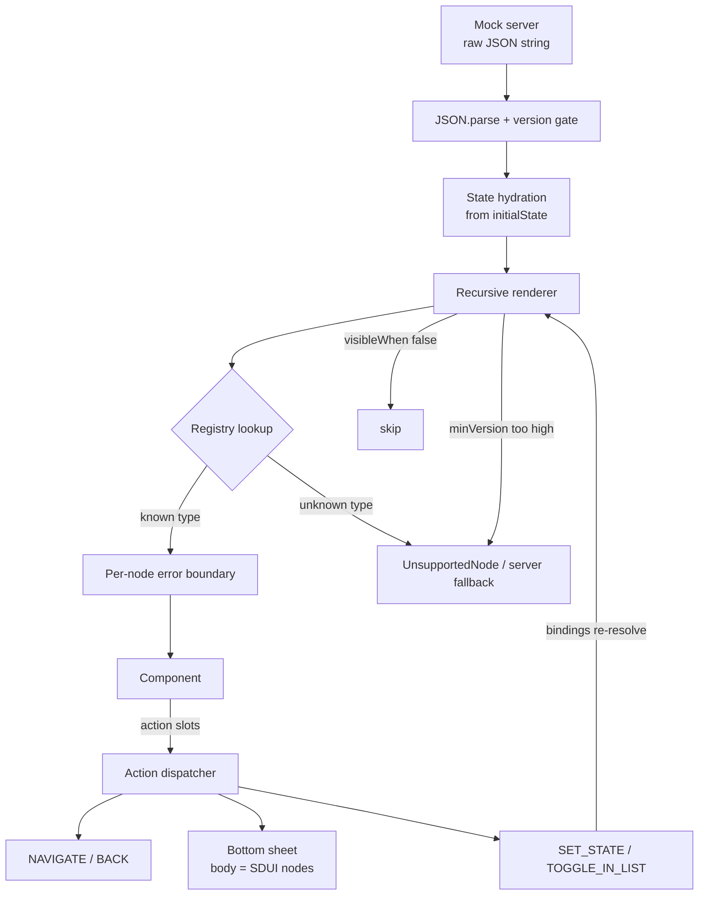

# Cars24 SDUI Engine — React Native

A Server-Driven UI engine for React Native (TypeScript, strict). The server sends JSON; the client renders the page. Layout, content, interactions, conditional visibility, and degradation behavior all live in the payload — changing the JSON changes the app on every device with no release.

## Screen choice

**Cars24 Home / Landing page**, replicated at `src/data/homeSDUI.json`, plus an SDUI-driven **Car Details** page (`src/data/carDetailsSDUI.json`) reached through a JSON-declared `NAVIGATE` action.

Why home: it is the densest screen in the app and clears every bar in the brief — 8 visually distinct section types (header with search/location, category chips, promo banners, car-card carousel, EMI calculator, 2-column grid, value-prop strip, CTA footer), a horizontal rail *and* a vertical grid, and interactions that must be server-driven to count: chip selection that actually filters the inventory, a tenure selector that recomputes the shown EMI, sheet-based pickers, and card→detail navigation.

## Setup

### Prerequisites

| Tool | Version |
|---|---|
| Node.js | ≥ 22.11 |
| JDK | 17 (Android) |
| Android Studio / SDK | API 34+, an emulator or USB device with debugging on |
| Xcode + CocoaPods | latest (iOS, macOS only) |
| Watchman | recommended on macOS (`brew install watchman`) |

### Get the code

**Option A — clone from GitHub:**

```bash
git clone https://github.com/abhay2767/sdui.git
cd sdui
```

**Option B — from the project zip:** unzip, `cd` into the folder (`node_modules` is intentionally excluded — the install step below restores it).

### Install & run

```bash
npm install                        # restores node_modules

# Terminal 1 — the dev server. Keep this window open.
npm start

# Terminal 2 — Android (device/emulator)
npx react-native run-android

# Terminal 2 — iOS (macOS only; first run needs pods)
cd ios && pod install && cd ..
npx react-native run-ios
```

In-app: the dark bar at the top shows live measurements; **📊 Compare** opens the benchmark screen; **🎞 5s frames** samples scroll frame drops while you scroll.

**Live-edit demo:** edit `src/data/homeSDUI.json` (change a title, reorder sections, add a `TEXT` node), save — the page updates with zero client code. That is the point of the project.

### Prebuilt release APK

The zip ships with **`cars24-sdui-release.apk`** at the project root (signed with the debug keystore, JS bundled in — no Metro needed):

```bash
adb install -r cars24-sdui-release.apk
```

To rebuild it yourself:

```bash
cd android && ./gradlew app:assembleRelease
# → android/app/build/outputs/apk/release/app-release.apk
```

> Benchmarking note: PERF.md's numbers were recorded on the release build with `MOCK_NETWORK_LATENCY_MS = 0` (see `src/sdui/server/mockServer.ts`). The committed default is `400` so the skeleton loading states are visible in the demo; set it to `0` before reproducing the benchmark.

### Troubleshooting

| Symptom | Cause → fix |
|---|---|
| Red screen: **"No script URL provided"** | Metro isn't running. Debug builds fetch JS from Metro on port 8081 — run `npm start` and reload (⌘R in the iOS simulator, `R` twice / shake → Reload on Android). |
| JSON edits don't show up despite reloading | Metro's file-watcher went stale. `watchman watch-del-all && npm start --reset-cache`, then reload once. |
| `spawn ./gradlew EACCES` on `run-android` | Exec bit lost in transit (zip/copy): `chmod +x android/gradlew`. |
| iOS build can't find node | `ios/.xcode.env.local` resolves node dynamically; ensure `node` is on your PATH. |

## Architecture



Layout of `src/sdui/`:

| Directory | Responsibility |
|---|---|
| `types/` | The schema — the server↔client contract |
| `engine/` | Pure logic: condition evaluation, binding resolution, versioning |
| `renderer/` | Recursive node renderer; holds **zero** component-name knowledge |
| `registry/` | The single place a server-side `type` maps to a native view |
| `context/` | Runtime state + action dispatcher |
| `components/` | Generic primitives + Cars24 composites (all `React.memo`) |
| `server/` | Mock backend serving payloads as raw JSON strings |
| `utils/` | Perf store, timing hooks, logger |

## Schema design rationale

A node is:

```jsonc
{
  "id": "car_1",
  "type": "CAR_CARD",                      // registry key
  "props": { "price": "₹{{state.x}}" },    // bindings resolve at render time
  "style": { "marginTop": 8 },             // RN style object (never CSS strings)
  "visibleWhen": { "stateKey": "selectedCategory", "oneOf": ["all", "suv"] },
  "actions": { "onPress": { "type": "NAVIGATE", "payload": { "screen": "CarDetails" } } },
  "minVersion": "2.0",                     // optional per-node version gate
  "fallback": { "type": "BANNER", "props": { } },  // what older clients render
  "children": []
}
```

The decisions that matter:

1. **Action slots, not action switch-statements in the renderer.** `actions` maps arbitrary callback-prop names (`onPress`, `onLocationPress`, `onSelect`…) to action definitions. The renderer converts each key into a dispatcher function prop mechanically. Adding a component with new callbacks requires **no renderer changes** — this is what keeps the engine from being "hardcoded to one page wearing a JSON costume."
2. **Bindings (`{{state.*}}`, `{{item.*}}`, `{{event.*}}`) instead of an expression language.** Strings interpolate; whole-string bindings keep their type. Deliberately no arithmetic/logic in the client: derived values (like per-tenure EMI) are server-precomputed and carried in the payload. Logic in the binary is the thing SDUI exists to remove.
3. **Conditions are data.** `visibleWhen` with `equals/oneOf/contains/gt/lt` plus `all/any/not` composition is how chip selection filters cars with JSON only. Malformed conditions default to *visible* — a server bug should never blank a section silently.
4. **Style objects, not CSS strings.** Parsed once by `JSON.parse`, passed straight to RN. Optional `$color.primary` tokens resolve against a payload-level theme.
5. **Two component tiers.** Generic primitives (`TEXT`, `ROW`, `CARD`, `LIST_ITEM`, `SEGMENTED_CONTROL`, …) make unseen screens a JSON-only job; Cars24 composites (`CAR_CARD`, `HEADER`, …) exist because high-traffic sections deserve hand-tuned native implementations. Every composite is *expressible* in primitives — composites are an optimization, not a dependency.

## Failure containment (three layers)

1. **Unknown `type`** → registry returns `undefined` → renderer shows the server's `fallback` node, else `UnsupportedNode` (logged). Demo: the `AI_CAR_INSPECTOR_3D` node in the home payload.
2. **Known component, bad props, render throws** → per-node `NodeErrorBoundary` contains the crash to that section and logs it. Covered by tests.
3. **Payload major version above client** → whole page renders a "please update" state rather than half-trusting fields whose meaning changed.

## Versioning story

Client declares `CLIENT_SCHEMA_VERSION` (currently `1.2`); payloads declare `version` and optionally per-node `minVersion`.

- **Minor bumps are additive** (new node fields, new action types). Old clients accept newer-minor payloads; each unknown node type degrades individually, unknown *fields* are simply ignored, and unknown *action types* log-and-skip. New capability + old client = graceful partial page, never a crash.
- **Major bumps mean existing fields changed meaning.** Old clients refuse the payload wholesale and show an update prompt. In production the client would send its schema version in the request header and the server would serve the newest payload ≤ that version — so majors are a server-side routing concern, and the client check is the last line of defense.
- **Per-node `minVersion` + `fallback`** lets one payload serve mixed fleets: newer clients render the new section, older ones render the server-chosen fallback. Demo: the "Live Auction Bidding" node (gated at 2.0) renders its fallback banner in the current app.

## Trade-offs (deliberate cuts, with reasons)

- **No client-side expression language** — server precomputes; see rationale #2. Costs some payload size (EMI carried per tenure), buys a dumb, safe client.
- **ScrollView, not FlatList, for the page body** — at ~60 nodes, virtualization overhead isn't earned; the schema has `forEach`/`template` repetition so a `LIST` type backed by FlatList is a contained future addition for feed-length screens (noted in COVERAGE.md).
- **Binding grammar carries exactly one operator** — `{{state.wishlist contains car_1}}` (membership → boolean, powering the wishlist hearts). It was initially cut, then added when the wishlist needed it — at ~15 lines it stayed within the "presentation state only, no client-side business logic" rule. Anything richer still belongs on the server.
- **Single global state bag, not per-page scopes** — right-sized for two pages; a `pageId`-namespaced scope is where this goes next.
- **Mock server is in-process** — the brief allows it; the fetch path is still string→parse so the measured pipeline matches a networked one minus latency.
- **Theme scale values freeze at launch** — `SPACING`, `TEXT_VARIANTS`, and `StyleSheet.create` blocks capture `hs/vs/msc` at import time (the reference design system's own pattern). Live rotation/split-screen resizing is handled where it matters visually — Carousel item width and Grid columns use the reactive `useResponsive` hook; static text/padding re-scale on next launch.
- **LTR-assumed layouts** — no `I18nManager` RTL pass yet; flagged for a localization milestone.
- **New architecture** — RN 0.86 runs Fabric by default; the engine is renderer-agnostic (it emits ordinary React elements), so nothing in `src/sdui` is architecture-coupled.

## Security posture

Payloads are authored server-side but pass through tooling and humans, so the client treats them as *semi-trusted*:
- `NAVIGATE` targets are checked against a screen allowlist ([navigationRef.ts](src/navigation/navigationRef.ts)); unknown screens reject-and-log.
- `OPEN_URL` only accepts `https://` — `tel:`/`sms:`/`javascript:` payloads reject-and-log.
- Navigation flows through a module-level `navigationRef`, so actions behave identically in screens, bottom-sheet bodies, and any future surface — there is no prop-drilled navigator to forget.
- Roadmap (documented, not built): zod validation of the payload at the parse boundary with per-node quarantine, an action middleware pipeline (analytics/telemetry/allowlists as composable layers), and payload caching with ETag + kill-switch.

## Docs

- [PERF.md](PERF.md) — methodology, static-vs-SDUI benchmark, optimization loop
- [COVERAGE.md](COVERAGE.md) — registry, expressible patterns, honest coverage claim
- [AI_WORKFLOW.md](AI_WORKFLOW.md) — tool stack, prompt→outcome stories, AI failure case, verification

## Verification

```bash
npx tsc --noEmit   # strict, clean
npx eslint src     # 0 errors
npx jest           # 38 tests: conditions, bindings, versioning, renderer safety, action security
```
