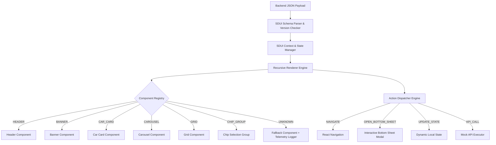

# 🚗 CARS24 Server Driven UI (SDUI) Engine

A production-grade, highly performant, and extensible **Server Driven UI (SDUI) Framework** built for React Native (TypeScript).

This repository implements a JSON-driven UI engine where entire screens, layout structures, user actions, component themes, and interactive states are dynamically controlled from the backend without requiring app updates.

---

## 🏗️ System Architecture



---

## ⚡ Key Features

1. **Zero-Hardcoded UI Logic**: Layouts, components, styles, hierarchy, and actions are 100% specified via JSON.
2. **Component Registry Mapping**: Map JSON type string identifiers (`HEADER`, `CAR_CARD`, `CAROUSEL`, etc.) directly to React Native components.
3. **Graceful Fallback & Crash Prevention**: Unsupported or novel component types render an inline warning box with log telemetry, ensuring zero app crashes.
4. **Declarative Action Dispatcher**: Handles user actions (`NAVIGATE`, `OPEN_BOTTOM_SHEET`, `UPDATE_STATE`, `API_CALL`) defined in JSON.
5. **Schema Versioning**: Client compares `schemaVersion` against supported version and handles backward compatibility.
6. **Real-time Performance Benchmarking**: Side-by-side comparison screen comparing static hardcoded UI vs SDUI engine rendering.

---

## 📁 Project Structure

```
/src
  /sdui
    /components     # Reusable UI components (Header, Banner, CarCard, Carousel, Grid, etc.)
    /registry       # Type string to React Component registry mapping
    /renderer       # Recursive node renderer engine
    /actions        # Action dispatcher & event handlers
    /types          # TypeScript interfaces for JSON schema
    /utils          # Performance timer, telemetry logger, versioning utilities
    /context        # SDUI global state & action context provider
  /screens
    HomeScreenSDUI.tsx    # JSON-driven SDUI Home Screen
    HomeScreenStatic.tsx  # Hardcoded UI for performance benchmark baseline
    CarDetailsScreen.tsx  # Target detail screen for NAVIGATE action
    PerfScreen.tsx        # Performance measurement & telemetry log viewer
  /data
    homeSDUI.json         # Comprehensive SDUI layout & payload for Cars24 Home
    staticHomeData.ts     # Baseline data fixture for static comparison
```

---

## 📄 JSON Schema Overview

```json
{
  "version": "1.0",
  "pageId": "CARS24_HOME_SCREEN",
  "initialState": {
    "selectedCategory": "all"
  },
  "page": [
    {
      "id": "header_1",
      "type": "HEADER",
      "props": {
        "title": "CARS24",
        "location": "Gurgaon, NCR ▾"
      }
    },
    {
      "id": "carousel_1",
      "type": "CAROUSEL",
      "props": { "title": "⚡ Hot Picked Cars Today" },
      "children": [
        {
          "id": "car_1",
          "type": "CAR_CARD",
          "props": { "title": "Hyundai Creta SX", "price": "₹11.45 Lakh" },
          "action": {
            "type": "NAVIGATE",
            "payload": { "screen": "CarDetails", "params": { "carId": "car_1" } }
          }
        }
      ]
    }
  ]
}
```

---

## 🚀 Setup & Execution Instructions

### 1. Installation
```bash
git clone https://github.com/abhay2767/sdui.git
cd sdui
npm install
```

### 2. Running on Android
```bash
npx react-native run-android
```

### 3. Running on iOS
```bash
cd ios && pod install && cd ..
npx react-native run-ios
```

### 4. Running Performance Benchmark
Inside the app, tap the **"📊 Compare"** button on the top performance bar to open the live benchmark comparison and telemetry log console.

---

## 🎯 Design Decisions & Trade-Offs

- **Recursive Tree Traversal**: We chose a clean recursive renderer (`SDUIRenderer`) over flat rendering to support deep nesting (e.g. CarCards inside Carousels inside Containers).
- **React.memo Optimization**: Every component in the registry is wrapped in `React.memo` to prevent re-renders when parent state updates.
- **Action Dispatcher via Context**: Using React Context for action dispatching allows deeply nested nodes to trigger navigation or open modal sheets without prop drilling.

---

## 📦 Documentation

- [PERF.md](file:///d:/Abhay_Work/assignment_cars24/sdui_app/PERF.md) – Performance benchmark details & Static vs SDUI overhead analysis.
- [COVERAGE.md](file:///d:/Abhay_Work/assignment_cars24/sdui_app/COVERAGE.md) – Component coverage, patterns, and extension points.
- [AI_WORKFLOW.md](file:///d:/Abhay_Work/assignment_cars24/sdui_app/AI_WORKFLOW.md) – Record of prompts, AI outputs, failure cases, and verification strategies.
